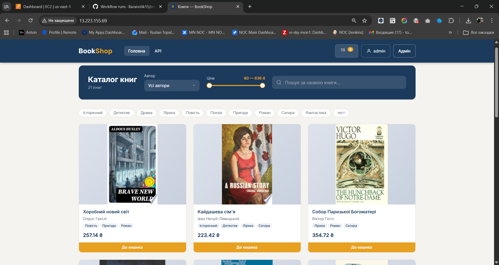
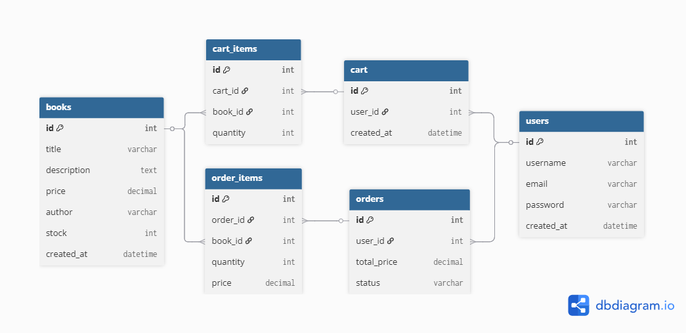

# online-bookshop

Online bookstore built with Django REST Framework. Features a web UI, shopping cart, orders, and Stripe payments. Supports S3 media storage, email confirmation on registration, role-based admin panel, and CI/CD deployment to EC2.

**Site preview:** (http://13.223.155.69/) 



## Database schema



# 📚 Bookshop API

REST API for an online book store built with Django REST Framework.

## 🚦 Rate Limiting

All API endpoints are throttled to prevent abuse:

| Client | Limit |
|--------|-------|
| Anonymous (by IP) | 10 requests / minute |
| Authenticated (by user ID) | 60 requests / minute |

When the limit is exceeded the API returns `429 Too Many Requests` with a `Retry-After` header indicating how many seconds to wait.

To change the limits, edit `DEFAULT_THROTTLE_RATES` in `proj/settings.py`.

## 📖 Books

- `GET /api/books/` — list all books
- `GET /api/books/{id}/` — get book details (includes genres, author, stock)
- `POST /api/books/` — create a book
- `PUT /api/books/{id}/` — replace a book
- `PATCH /api/books/{id}/` — partial update
- `DELETE /api/books/{id}/` — delete a book

## 👤 Authors

- `GET /api/authors/` — list all authors
- `GET /api/authors/{id}/` — get author details
- `POST /api/authors/` — create an author
- `PUT /api/authors/{id}/` — replace an author
- `PATCH /api/authors/{id}/` — partial update
- `DELETE /api/authors/{id}/` — delete an author

## 🏷️ Genres

- `GET /api/genres/` — list all genres
- `GET /api/genres/{id}/` — get genre details
- `POST /api/genres/` — create a genre `{ "name": "Роман" }`
- `PUT /api/genres/{id}/` — replace a genre
- `PATCH /api/genres/{id}/` — partial update
- `DELETE /api/genres/{id}/` — delete a genre

When creating or updating a book, pass genre IDs via `genre_ids`:
```json
{ "title": "Кобзар", "author_id": 3, "price": "150.00", "genre_ids": [1, 4, 7] }
```

## 📦 Orders

Requires authentication.

- `GET /api/orders/` — list current user's orders
- `GET /api/orders/{id}/` — get order details
- `POST /api/orders/` — create a new order
- `PUT /api/orders/{id}/` — update order status
- `DELETE /api/orders/{id}/` — cancel/delete order

## 🛒 Cart

Single endpoint, requires authentication. All actions use `/api/cart/`.

- `GET /api/cart/` — get current user's cart (items + `total_price`)
- `POST /api/cart/` — add item `{ "book_id": 1, "quantity": 1 }` → returns `{ total_items, total_price }`
- `PATCH /api/cart/` — update quantity `{ "item_id": 5, "quantity": 3 }` → returns `{ subtotal, total }`
- `DELETE /api/cart/` — remove item `{ "item_id": 5 }` → returns `{ total_items, total_price }`

## 🔧 Admin panel

Available at `/admin/`. Built with [django-unfold](https://github.com/unfoldadmin/django-unfold).

**Access levels:**
| Role | Access |
|------|--------|
| Superuser | Full access to everything |
| Staff + group | Can edit models assigned to their group |
| Staff (no group) | Read-only |

**Groups** (create with `python manage.py create_groups`):
| Group | Models |
|-------|--------|
| Edit Books | Book, Author, Genre |
| Edit Orders | Order, OrderItem |
| Edit Users | User |

> Cart is read-only for everyone in the admin panel.

---

## 💻 Local development

**Requirements:** Python 3.12+

**1. Clone the repository:**
```bash
git clone https://github.com/your-username/online-bookshop.git
cd online-bookshop
```

**2. Create and activate virtual environment:**
```bash
python -m venv venv

# Windows
venv\Scripts\activate

# Linux/macOS
source venv/bin/activate
```

**3. Install dependencies:**
```bash
pip install -r requirements.txt
```

**4. Create `.env`:**
```bash
cp env-sample .env
# fill in SECRET_KEY and Stripe keys
```

> **Email confirmation** is required on registration. Locally, emails print to the console by default (`EMAIL_BACKEND=console`). The confirmation email template is at `templates/users/email_confirm.html`. To use real SMTP (e.g. Gmail), set these in `.env`:
> ```
> EMAIL_BACKEND=django.core.mail.backends.smtp.EmailBackend
> EMAIL_HOST=smtp.gmail.com
> EMAIL_PORT=587
> EMAIL_USE_TLS=true
> EMAIL_HOST_USER=your@gmail.com
> EMAIL_HOST_PASSWORD=your-app-password   # Google Account → Security → App passwords
> DEFAULT_FROM_EMAIL=BookShop <your@gmail.com>
> ```

**5. Apply migrations:**
```bash
python manage.py migrate
```

**6. Create a superuser:**
```bash
python manage.py createsuperuser
```

**7. Create admin groups (once):**
```bash
python manage.py create_groups
```

**8. Seed the database (optional):**
```bash
python fixture.py
```

**9. Run the server:**
```bash
python manage.py runserver
```

The app will be available at **http://localhost:8000**

---

## 🚀 Deployment (EC2 or any Linux host)

**Requirements:** Ubuntu server, Docker, Docker Compose, open port 8000 in firewall/Security Group.

**1. Install Docker:**
```bash
sudo apt update && sudo apt install -y docker.io docker-compose-plugin
sudo usermod -aG docker $USER && newgrp docker
```

**2. Clone the repository:**
```bash
git clone https://github.com/your-username/online-bookshop.git
cd online-bookshop
```

**3. Create and fill `.env`:**
```bash
cp env-sample .env
nano .env
```

Set the following values:
```
SECRET_KEY=           # generate: python -c "from django.core.management.utils import get_random_secret_key; print(get_random_secret_key())"
DEBUG=false
STRIPE_PUBLIC_KEY=pk_live_...
STRIPE_SECRET_KEY=sk_live_...
STRIPE_WEBHOOK_SECRET=whsec_...

EMAIL_BACKEND=django.core.mail.backends.smtp.EmailBackend
EMAIL_HOST=smtp.gmail.com
EMAIL_PORT=587
EMAIL_USE_TLS=true
EMAIL_HOST_USER=your@gmail.com
EMAIL_HOST_PASSWORD=your-app-password
DEFAULT_FROM_EMAIL=BookShop <your@gmail.com>
```

**4. Add your domain or IP to `ALLOWED_HOSTS` in `proj/settings.py`:**
```python
ALLOWED_HOSTS = ['localhost', '127.0.0.1', 'your-domain.com', 'your-ec2-ip']
```

**5. Build and start:**
```bash
docker compose up --build -d
```

The app will be available at **http://your-domain.com:8000**

**6. Create a superuser:**
```bash
docker exec -it online-bookshop-web-1 python manage.py createsuperuser
```

**7. Create admin groups (once):**
```bash
docker exec online-bookshop-web-1 python manage.py create_groups
```

**8. Seed the database (optional):**
```bash
docker exec online-bookshop-web-1 python fixture.py
```

**Useful commands:**
```bash
docker compose logs -f          # view logs
docker compose down             # stop (data preserved)
docker compose down -v          # stop and delete all data
docker compose up -d            # start after server reboot
```

---

## 🌐 Nginx (reverse proxy)

The file [`nginx.conf`](nginx.conf) is included in the repository and gets copied to the server automatically on every deploy.

**What it does:**
- Proxies all requests to Django (port 8000)
- Serves static files directly from `/opt/online-bookshop/staticfiles/`
- Serves media files directly from `/opt/online-bookshop/media/` (only when S3 is not used)

**One-time setup on the server (first deploy only):**
```bash
# Copy config and enable site
sudo cp /opt/online-bookshop/nginx.conf /etc/nginx/sites-available/bookshop
sudo ln -s /etc/nginx/sites-available/bookshop /etc/nginx/sites-enabled/bookshop
sudo rm -f /etc/nginx/sites-enabled/default

# Test and reload
sudo nginx -t && sudo systemctl reload nginx
```

After the first setup, nginx config is updated automatically on every deploy via CI/CD.

**To use a domain instead of IP**, replace `server_name _;` in `nginx.conf` with your domain:
```nginx
server_name yourdomain.com www.yourdomain.com;
```

---

## ☁️ AWS S3 (media storage)

Used for storing book cover images in production. Without S3, images are stored locally in `media/`.

**Setup:**
1. Create an S3 bucket (e.g. `online-bookshop-media`)
2. In bucket **Permissions → Block public access** — disable all blocks
3. Add **Bucket policy** for public read:
```json
{
  "Version": "2012-10-17",
  "Statement": [{
    "Effect": "Allow",
    "Principal": "*",
    "Action": "s3:GetObject",
    "Resource": "arn:aws:s3:::your-bucket-name/*"
  }]
}
```
4. Create an IAM user with `AmazonS3FullAccess`, generate Access Key
5. Add to `.env`:
```
AWS_ACCESS_KEY_ID=AKIA...
AWS_SECRET_ACCESS_KEY=...
AWS_STORAGE_BUCKET_NAME=online-bookshop-media
AWS_S3_REGION_NAME=us-east-1
```

When `AWS_ACCESS_KEY_ID` is set, Django automatically uses S3 for all media uploads.

---

## 🟢 Celery (background tasks)

Used for sending confirmation emails asynchronously so the user gets an instant response after registration without waiting for SMTP.

**How it works:**
1. User registers → Django puts a task in the Redis queue (database `2`) and immediately returns a response
2. Celery worker picks up the task and sends the email in the background

Celery worker runs as a separate Docker service and starts automatically with `docker compose up`.

**To view worker logs:**
```bash
docker compose logs -f celery
```

**To inspect queued tasks:**
```bash
docker compose exec redis redis-cli -n 2 KEYS "*"
```

**Email template** — edit the confirmation email at:
```
templates/users/email_confirm.html
```

---

## 🔴 Redis (caching)

Used for caching genre and author list responses. Reduces DB load on every page load.

- Genres (`/api/genres/`) and authors are cached for **5 minutes**
- Cache is automatically invalidated on create/update/delete
- Redis runs as a separate Docker service (database `1`)

Redis is included in `docker-compose.yml` and starts automatically with `docker compose up`. No additional setup required.

**To inspect cached keys:**
```bash
docker compose exec redis redis-cli -n 1 KEYS "*"
```

---

## 📋 Logging

Errors and key business events are logged to stdout and collected by Docker.

**What is logged:**
| Event | Level |
|-------|-------|
| User registered | INFO |
| Email confirmation sent / failed | INFO / ERROR |
| Email confirmed | INFO |
| Order paid via Stripe | INFO |
| Stripe webhook invalid signature | ERROR |
| Django 500 errors | ERROR |

**View logs in real time:**
```bash
docker compose logs -f web     # Django logs
docker compose logs -f celery  # Celery task logs
```

**Log rotation** is configured automatically — max 10 MB per file, last 3 files kept (30 MB total per service). No manual cleanup needed.

**To clear logs manually if needed:**
```bash
truncate -s 0 $(docker inspect --format='{{.LogPath}}' online-bookshop-web-1)
```

---

## ⚙️ CI/CD (GitHub Actions)

The workflow file is located at [`.github/workflows/ci-cd.yml`](.github/workflows/ci-cd.yml).

**How it works:**
- Every push or PR to `main` → runs the test suite with coverage check (min 80%)
- Every push to `main` (after tests pass) → automatically deploys to EC2 via SSH

**Required GitHub Secrets** (`Settings → Secrets and variables → Actions`):

| Secret | Description |
|--------|-------------|
| `SECRET_KEY` | Django secret key |
| `EC2_HOST` | EC2 public IP address |
| `EC2_USER` | SSH user on the server (e.g. `ubuntu`) |
| `EC2_SSH_KEY` | Private SSH key for connecting to EC2 |

**Setting up the SSH key on the server:**
```bash
ssh-keygen -t ed25519 -C "github-actions" -f ~/.ssh/github_actions -N ""
cat ~/.ssh/github_actions.pub >> ~/.ssh/authorized_keys
cat ~/.ssh/github_actions   # copy this into EC2_SSH_KEY secret
```

**To change the coverage threshold**, edit the `--cov-fail-under` flag in `ci-cd.yml`:
```yaml
run: pytest --cov=. --cov-report=term-missing --cov-fail-under=80
```

---

## 💳 Stripe (test payments)

Uses Stripe Sandbox for local development.

**Setup `.env`:**
```
STRIPE_PUBLIC_KEY=pk_test_...   # Publishable key from Stripe Dashboard → Developers → API keys
STRIPE_SECRET_KEY=sk_test_...   # Secret key from Stripe Dashboard → Developers → API keys
STRIPE_WEBHOOK_SECRET=whsec_... # Generated by stripe listen (see below)
```

**Start webhook listener:**
```bash
stripe listen --forward-to localhost:8000/orders/webhook/
```

The command prints:
```
> Ready! Your webhook signing secret is whsec_abc123...
```
Copy `whsec_abc123...` into `STRIPE_WEBHOOK_SECRET` in `.env`, then restart the Django server. Keep this terminal open while testing.

**Test card:**

| Field | Value |
|-------|-------|
| Card number | `4242 4242 4242 4242` |
| Expiry | any future date, e.g. `12/34` |
| CVC | any 3 digits, e.g. `123` |
| Name | anything |

After payment the order status changes from `pending` → `paid` via webhook.
